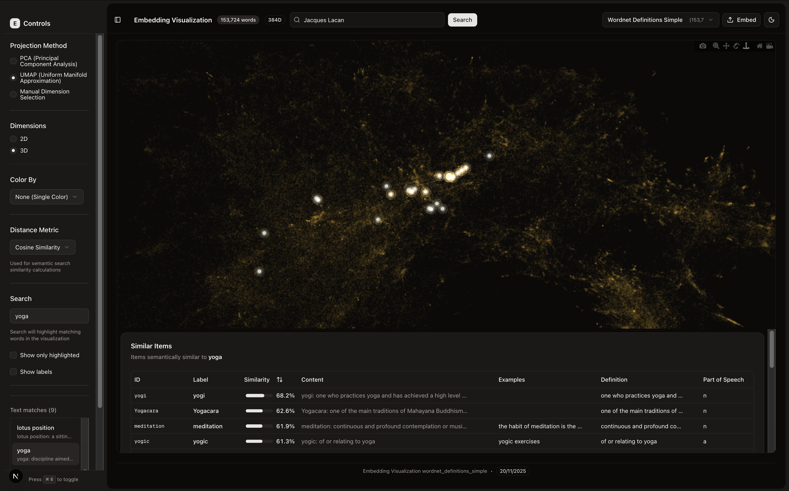

# Embedding Visualization and Dashboard

The project is a platform for generating, analysing and displaying word embeddings. Currently it allows to generate embeddings from either local datasets or hugging face. It uses either sentence-transformers or APIs to generate embeddings, and stores them in a ChromaDB. 

Everything can be done in the frontend, from retriving embeddings, to visualizing them, to analysing them.

Polish is not there, a lot of the functionalities are iffy at best, but the architecture is working, and the visualisation is quite good looking, - so, enjoy! 

(I'm trying to make it work for sparse embeddings as well and qwen embeddings, there were some interpretability experiments in the backend folder, but the code was... raw.)

*Note:* the first time it launches, there are no data to display, probably I should add a test little dataset. Anyways, click on the "Embed" button on the top right, it opens the collection manager page. There one can embed datasets or use the default "emotion one" (which is quite terrible as an example, since it doesn't have labels). Select the columns to embed, and click embed. Remotely the only provider tested that it's working is sentence-transformers. I will add more later. 




## Quick Start

```bash
# 1. Install all dependencies (Python, Rust, Node.js)
./install_requirements.sh

# 2. Start Backend API
./start_backend.sh
# Visit http://localhost:8000/graphql for GraphQL playground

# 3. Start Frontend Visualization
cd embedding_visualization
npm install
npm run dev
# Visit http://localhost:3000

# First time: Click "Embed" button (top right) to create your first collection
# Try the HuggingFace tab to embed a dataset like "emotion" or "squad"
```

**Note**: The first time you launch, there are no collections to display. Use the `/test-embed` page (click "Embed" button in header) to create your first collection from HuggingFace datasets or local files.

## Project Structure

### `/interpretability_backend/` - Backend & Core Pipeline

The backend service powered by FastAPI, Strawberry GraphQL, and ChromaDB.

**Key Features:**
- GraphQL API for semantic search and dataset management
- ChromaDB vector database integration
- Embed HuggingFace datasets or local files (CSV, JSON, Parquet)
- Multi-provider support (SentenceTransformers, OpenAI, Cohere, etc.)
- **Topic extraction & clustering** - HDBSCAN clustering with c-TF-IDF keywords and optional LLM labeling
- **Real-time progress tracking** - WebSocket subscriptions for live embedding progress
- **Resumable jobs** - interrupted embeddings can be resumed from where they left off
- **Status messages** - detailed stage updates (sorting, loading model, computing projections)
- **Lazy embedding function loading** - models only load when needed for semantic search
- **Dimension caching** - prevents unnecessary test embeddings, uses stored metadata
- **Model persistence** - embedding models stay in memory across requests for fast queries

**Quick Commands:**
```bash
# Start backend server
./start_backend.sh

# Run tests
uv run pytest
```

See [interpretability_backend/README.md](interpretability_backend/README.md) for detailed documentation.

### `/embedding_visualization/` - Interactive Web Frontend

Modern Next.js 15 web application for 2D/3D visualization, clustering, and semantic search analysis.

**Tech Stack:**
- Next.js 15, React 19, TypeScript 5
- Plotly.js for WebGL-accelerated 2D/3D visualizations
- Apollo Client 4 for GraphQL queries
- Tailwind CSS 4 with OKLch color system
- Shadcn UI (30+ Radix UI components)
- WASM-based density clustering

**Architecture:**
- **95+ TypeScript files** with modular component and hook-based design
- **21 React components** for UI (plots, controls, tables, tooltips, etc.)
- **13 custom hooks** for data loading, search, visualization, and responsive sizing
- **Type-safe GraphQL** queries and mutations with Apollo Client
- **Flexible metadata support** - adapts to any collection schema

**Main Pages:**
- `/` - Main visualization dashboard with 2D/3D scatter plots, semantic search, and clustering
- `/test-embed` - Dataset embedding interface with three tabs:
  - **HuggingFace**: Browse and embed any HF dataset (preview, column selection, model choice)
  - **Local File**: Upload and embed parquet/JSON/CSV files
  - **Collection Manager**: View, edit metadata, and delete existing collections
  - Real-time progress modal during embedding with status messages
  - Interrupted jobs panel with resume capability

**Key Features:**
- **Generic visualization** - works with any embedding collection stored in ChromaDB
- **Auto-detection** - intelligently detects label and category fields from metadata
- **Dynamic coloring** - categorical, sequential, and diverging color scales with presets
- **Unified search** - text filtering with auto-select + semantic search + results display
- **Live progress modal** - real-time embedding progress with status messages via WebSocket
- **Resume interrupted jobs** - panel showing interrupted jobs with one-click resume
- **Responsive design** - ResizeObserver-based sizing, resizable panels, dark mode
- **Performance optimized** - WebGL rendering, logarithmic marker sizing, preserves zoom/pan

**Quick Commands:**
```bash
cd embedding_visualization
npm install
npm run dev  # Development server at http://localhost:3000
npm run build && npm start  # Production build
```

See [embedding_visualization/README.md](embedding_visualization/README.md) for detailed documentation.

## Data Flow

```
Data Sources:
├── HuggingFace Datasets
├── Local Files (parquet, JSON, CSV)
└── Image Datasets
    ↓
Embedding Models:
├── Text: all-MiniLM-L6-v2 (default), OpenAI, Cohere, etc.
├── Image: ViT
└── Vectors: Pre-computed
    ↓
ChromaDB Vector Database (interpretability_backend/resources/vector_db)
    ↓
Topic Extraction (optional):
├── HDBSCAN clustering on projections
├── c-TF-IDF keyword extraction
└── OpenAI LLM labeling (optional)
    ↓
GraphQL API (FastAPI + Strawberry)
    ↓
Web UI (Next.js)
```

## Key Technologies

**Backend:**
- Python 3.12+, `uv` package manager
- ChromaDB, FastAPI, Strawberry GraphQL
- sentence-transformers, scikit-learn, UMAP
- PyTorch (MPS/CUDA/CPU auto-detection)
- HuggingFace datasets, transformers (ViT for images)

**Frontend:**
- Next.js 15, React 19, TypeScript 5
- Plotly.js + react-plotly.js (WebGL rendering)
- Apollo Client 4 (GraphQL)
- Tailwind CSS 4 with OKLch color system
- Shadcn UI (30+ Radix UI primitives)
- @tanstack/react-table (sortable tables)
- d3-scale + d3-scale-chromatic (color scales)
- WebAssembly (WASM-based density clustering)
- react-resizable-panels (resizable layout)
- next-themes (dark mode)

## Frontend Architecture

### Component Overview

The frontend is built with a modular architecture separating concerns into components, hooks, and utilities.

**Key Components** (21 in `app/components/`):
- **DashboardPanel**: Main layout orchestrator with resizable panels (plot, legend, results table)
- **ScatterPlot2D**: 2D Plotly visualization with WebGL, density clustering, aspect ratio preservation
- **ScatterPlot3D**: 3D Plotly with smooth spherical camera interpolation and cubic easing
- **EmbeddingSidebar**: Floating sidebar with controls and selected point info (offcanvas collapsible)
- **VisualizationControls**: Projection method, dimensions, manual selection, color scale controls
- **AppHeader**: Collection selector, semantic search bar, theme toggle, embed button
- **Legend**: Dynamic category color legend with preset support (e.g., POS colors)
- **SimilarItemsTable**: Sortable table of semantic search results with dynamic metadata columns
- **TextSearchResultsList**: Scrollable list of text search matches in sidebar
- **SelectedPointCard**: Displays selected point details with metadata
- **FrostedTooltip**: Custom frosted glass tooltip with warm gold tint for hover interactions
- **ColorScaleSelector**: UI for selecting color scale type (categorical/sequential/diverging)

**Test-Embed Components** (8 in `app/test-embed/components/`):
- **DatasetEmbeddingForm**: HuggingFace dataset selection and embedding configuration
- **LocalFileEmbeddingForm**: Local file upload and embedding configuration
- **CollectionManager**: View, edit, and delete existing collections
- **EmbeddingModelSelector**: Select provider and model for embedding

### Custom Hooks

**Data & Loading** (5 hooks):
- `useEmbeddingData`: Loads collection from GraphQL, auto-detects display fields, computes category options
- `useCollections`: Loads available collections, transforms GraphQL response to manifest
- `useVisualizationPoints`: Transforms raw data to visualization points, handles projections (PCA/UMAP/manual)
- `useDensityClustering`: WASM clustering module (~500ms for 150k points)
- `useEmbedDataset`: GraphQL mutations for embedding datasets (used in /test-embed)

**Search & Interaction** (3 hooks):
- `useAppSearch`: Unified search orchestration (text queries + point clicks → semantic search)
- `useSemanticSearch`: GraphQL semantic search (findSimilarByQuery + findSimilarById) with distance metrics
- `useHighlightedIndices`: Combines text + semantic search highlights into HighlightMap with similarity scores

**Utilities** (5 hooks):
- `useContainerDimensions`: Responsive sizing via ResizeObserver, returns width/height on resize
- `use-debounce-callback`: Debounced callbacks for search input
- `use-debounce-value`: Debounced values for reactive updates
- `use-mobile`: Mobile detection for responsive UI
- `use-unmount`: Cleanup on unmount for tear-down logic

### Data Flow

```
page.tsx (orchestration)
  ↓
useCollections() → get available collections
  ↓
useEmbeddingData() → load selected collection from GraphQL
  ↓
useVisualizationPoints() → compute 2D/3D points from projections
  ↓
useAppSearch() → manage semantic search state
  ↓
useHighlightedIndices() → combine text + semantic highlights
  ↓
DashboardPanel (render plots + sidebar + tables)
```

### Type System

**Core Data Types** (`lib/types/types.ts`):
- `EmbeddingData`: Main container with metadata, ids, documents, itemMetadata, projections, displayConfig
- `Point2D/Point3D`: Visualization points with x, y, z, id, label, document, category, index, metadata
- `VisualizationState`: method, mode, selectedDimensions, colorByField, colorScaleType, searchQuery, distanceMetric, etc.
- `DisplayConfig`: labelField, categoryField, categoryValues, categoryName (auto-detected or user-specified)
- `SemanticSearchResult`: id, label, document, category, similarity, distance, metadata
- `HighlightMap`: Map<index, similarity> combining text and semantic search highlights

### Styling System

- **OKLch Color System**: Perceptually-uniform colors for consistent dark/light themes
- **Frosted Glass**: Custom `.frosted-tooltip` class with warm gold tint and backdrop-filter blur
- **Dynamic Colors**:
  - Categorical: Presets for known types (POS) + D3 20-color palette for unknowns
  - Sequential: Viridis scale (0→1) for continuous data
  - Diverging: RdBu scale (-1→0→1) for bipolar data
- **Responsive**: ResizeObserver + Plotly responsive layout
- **Z-Index Layers**: Plot (0) → Legend (10) → Results Table (20) → Sidebar (40)

### Search & Interaction Flow

1. **Text Search**: User types in search bar
   - Local `String.includes()` filtering on label, document, metadata
   - Auto-selects first match
   - Displays all matches in sidebar list

2. **Point Selection**: User clicks point or selects from search results
   - Triggers semantic search via GraphQL (findSimilarById)
   - Returns top N similar items with similarity scores
   - Displays results in table and highlights in plot

3. **Semantic Search**: User enters query in header search
   - Embeds query and searches collection (findSimilarByQuery)
   - Returns top N similar items
   - Highlights results in plot with glow effects

4. **Highlighting**: Combined from multiple sources
   - Text search: Solid highlight (similarity = 1.0)
   - Semantic search: Gradient blue→gold based on actual similarity
   - Multi-layer glow: Outer/inner/core halos with calculateLuminosity

## Topic Extraction & Clustering

The system supports automatic topic discovery using HDBSCAN clustering, c-TF-IDF keyword extraction, and optional LLM-generated labels.

### How It Works

1. **Clustering**: Runs HDBSCAN on projection coordinates (UMAP 2D preferred)
2. **Keywords**: Extracts top-N keywords per cluster using c-TF-IDF
3. **Labels**: Optionally generates human-readable topic names via OpenAI
4. **Storage**: Adds `topic_id` and `topic_label` to each item's metadata
5. **Visualization**: Topics automatically appear as categorical fields in the frontend

### Usage

**Extract topics from existing collection:**
```graphql
mutation {
  extractTopics(input: {
    collectionName: "my_collection"
    minTopicSize: 10
    nKeywords: 10
    useLlmLabels: false
    projectionType: "umap_2d"
  }) {
    numTopics
    numNoisePoints
    topics {
      topicId
      label
      keywords { word score }
      count
    }
  }
}
```

**Auto-extract during embedding:**
```graphql
mutation {
  embedHuggingfaceDataset(input: {
    datasetId: "squad"
    collectionName: "squad_with_topics"
    columns: ["question"]
    computeProjections: true
    extractTopics: true
    topicConfig: {
      minTopicSize: 15
      useLlmLabels: true
    }
  }) {
    totalEmbedded
    projectionsComputed
  }
}
```

### Configuration

- `minTopicSize`: Minimum points per cluster (default: 10)
- `nKeywords`: Keywords per topic (default: 10)
- `useLlmLabels`: Generate LLM labels (default: false, requires `CHROMA_OPENAI_API_KEY`)
- `llmModel`: OpenAI model (default: "gpt-4o-mini")
- `projectionType`: Projection to cluster on (default: "umap_2d")

### Frontend Integration

Once topics are extracted:
- `topic_id` and `topic_label` appear in the "Color By" dropdown
- Legend shows topic names and point counts
- Click legend entries to toggle topic visibility
- Noise cluster (-1) displayed as "Unclustered" in gray

## API Reference

### GraphQL API

The backend provides a GraphQL API (`http://localhost:8000/graphql`) for:

```graphql
# Semantic search
query {
  semanticSearch(
    collectionName: "my_collection"
    query: "search query"
    nResults: 10
  ) { ... }
}

# Embed a dataset
mutation {
  embedHuggingfaceDataset(...) { ... }
}

# Extract topics
mutation {
  extractTopics(input: {
    collectionName: "my_collection"
    minTopicSize: 10
  }) { ... }
}
```

## Documentation

- **[interpretability_backend/README.md](interpretability_backend/README.md)** - Backend documentation
- **[embedding_visualization/README.md](embedding_visualization/README.md)** - Frontend documentation
