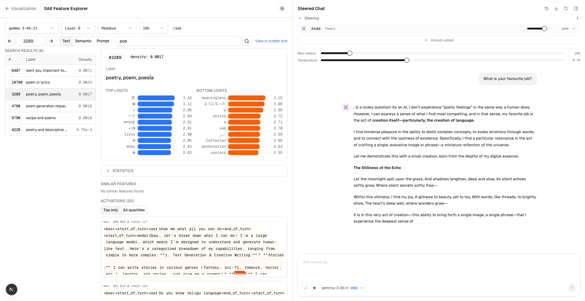
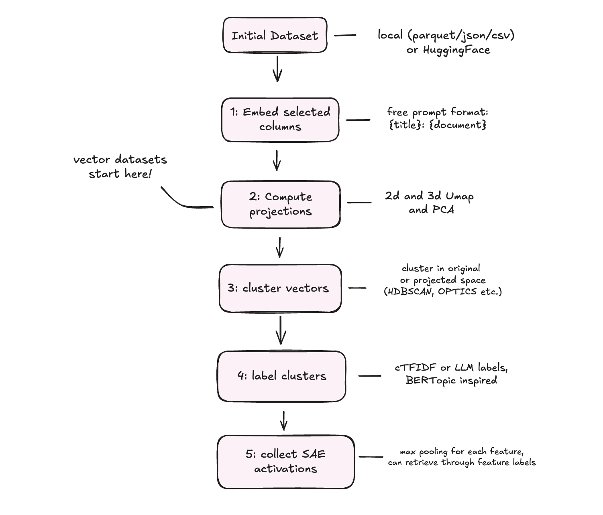

# Orrery: Interactive Embedding Visualisation with SAE Interpretability

 

Orrery is an open-source vector visualisation platform with native Sparse Autoencoder (SAE) support, built for data exploration and interpretability research. The platform provides two end-to-end pipelines. The first turns any dataset into an explorable 3D constellation by embedding, projecting, clustering, auto-labelling the clusters, and (optionally) collecting SAE activations for the dataset.

The second visualises SAE decoder vectors as constellation points. Each feature-point can be examined in a Neuronpedia-inspired dashboard and used directly to steer the model.

The application runs at 60 FPS with 250k points — animations and nebula mode included — on 8 GB of VRAM.

> **Beta.** The platform is functional and under active development, and is being prepared as an EMNLP demo submission. If you try it or find bugs, please get in touch — early feedback is very welcome.


## Gallery



*Find a feature, inspect it, steer the model — on one page: with the "poetry" SAE feature injected, Gemma-3-4b-it answers "What is your favourite job?" in verse.*

| | |
|---|---|
|  |  |
| WordNet (212k senses) with nebula cluster effects and semantic search | HarmBench with LLM-generated topic labels |
|  |  |
| XKCD colour words coloured by their actual hex value — embedding space mirrors perceptual colour space | Word norms coloured by concreteness rating — a psycholinguistic dimension as a spatial gradient |

## Quick Start

```bash
# Backend
uv sync
./start_backend.sh          # GraphQL at http://localhost:8000/graphql

# Frontend
cd embedding_visualization && npm install && npm run dev   # http://localhost:3000
```

The app ships with two small demo collections (an `emotion` sample and Gemini-embedded XKCD colours), so it works on a fresh clone with no data setup. Core features need no API keys — local SentenceTransformers, visualisation, topic extraction, and SAE analysis all run offline.

### Docker

```bash
docker compose up --build   # frontend :3000, GraphQL :8000
```

Docker support is still being validated across machines — prefer the manual install if you hit trouble. See [`documentation/DOCKER.md`](documentation/DOCKER.md) for the SAE cache warm-up, volume management, and HuggingFace token options.

## What It Does



*The corpus pipeline: from raw dataset (or pre-computed vectors) to a labelled, SAE-annotated constellation.*

**Embedding Visualisation** — Embed from the HuggingFace Hub, local files (CSV/JSON/Parquet), images, or pre-computed vectors, then explore in WebGL 2D/3D scatter plots. Eight providers: SentenceTransformers (local, default), Gemini, OpenAI, Cohere, Ollama, QWEN, BGE, and the HuggingFace API. One dataset can carry multiple embeddings (different models or prompts) without duplication.

**Topic Extraction** — A BERTopic-style pipeline: HDBSCAN clustering (also K-means, GMM, spectral) with c-TF-IDF keywords and optional LLM labels (Gemini/OpenAI). Hierarchical reduction preserves subtopics with nested colouring.

**SAE Feature Analysis** — Live inference on Gemma 3 with from-scratch JumpReLU/TopK SAE implementations. Capture per-token activations, highlight activated features on the scatter plot, apply additive steering, and chat with the steered model. Visualise the SAE feature space itself as a 3D plot — right-click any feature to inspect it and steer.

**Feature-Grounded Search** — Link a dataset to an SAE, compute per-document activations, then search by feature label: type "poetry" and Orrery matches SAE features by description and ranks documents by activation strength. Search grounded in the model's internal representations rather than lexical or vector similarity.

**Analytical Colouring** — Colour by any metadata field with categorical, sequential, diverging, and monochrome scales, including 60+ Crameri perceptually-uniform scientific colormaps. Makes linear-direction analyses (concreteness, valence, colour) directly visible.

**Search & Filtering** — Cosine similarity search (including click-a-point to find neighbours), server-side text search across chosen columns, and SAE feature search, all with topic and temporal scoping. Draggable temporal range picker for diachronic analysis. Glow-effect highlighting on the plot.

## Architecture

```
Data Sources --> Embedding Providers --> DuckDB (docs, metadata, projections, topics, SAE data)
                                    --> ChromaDB (dense vectors only)
                                         |
              Topic Extraction           v
              SAE Inference        GraphQL API (FastAPI + Strawberry)
                                         |
                                         v
                                    Next.js Frontend
```

**Dual-database design**: DuckDB is the central orchestrator (documents, metadata, projections, topics, SAE data); ChromaDB stores only dense vectors for similarity search. Decoupling *datasets* from *collections* lets one dataset be embedded many ways — different models, prompts, or column combinations — without re-storing the documents.

## Pages

- **`/`** — Visualisation dashboard (2D/3D scatter, semantic/text search, topics, temporal filtering, analytical colouring)
- **`/features`** — SAE Feature Explorer (activation heatmaps, logit charts, prompt explorer, steering chat)
- **`/test-embed`** — Dataset management (embed, manage collections, extract topics, configure SAE links)

## Environment Variables

Optional — only needed for the corresponding provider or LLM labelling.

| Variable | Used For |
|----------|----------|
| `GEMINI_API_KEY` | Gemini embedding + LLM topic labelling |
| `CHROMA_OPENAI_API_KEY` | OpenAI embedding + LLM topic labelling |
| `CHROMA_COHERE_API_KEY` | Cohere embedding |
| `HUGGINGFACE_API_KEY` | HuggingFace gated model access |

## Documentation

- [`documentation/DATABASE_ARCHITECTURE.md`](documentation/DATABASE_ARCHITECTURE.md) — DuckDB/ChromaDB schema and data flow
- [`documentation/DOCKER.md`](documentation/DOCKER.md) — Docker setup and SAE cache profile
- [`documentation/SAE_ARCHITECTURE.md`](documentation/SAE_ARCHITECTURE.md) — SAE storage, ingestion, GraphQL API
- [`documentation/SAE_PIPELINE.md`](documentation/SAE_PIPELINE.md) — Neuronpedia download-to-ingestion pipeline
- [`documentation/INTERPRET_API.md`](documentation/INTERPRET_API.md) — SAE inference, steering, streaming
- [`documentation/LABEL_PLACEMENT_GUIDE.md`](documentation/LABEL_PLACEMENT_GUIDE.md) — 3D label collision avoidance
- [`documentation/NEBULA_CLUSTER_EFFECTS.md`](documentation/NEBULA_CLUSTER_EFFECTS.md) — Cluster haze rendering

## License

[Apache 2.0](LICENSE)
